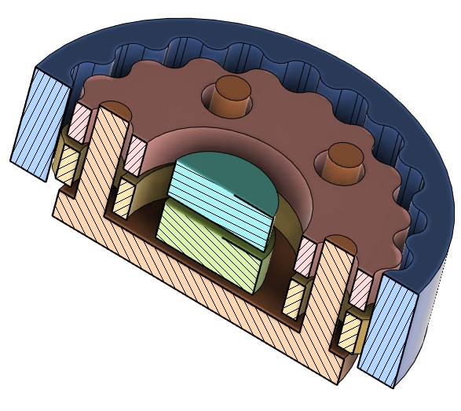
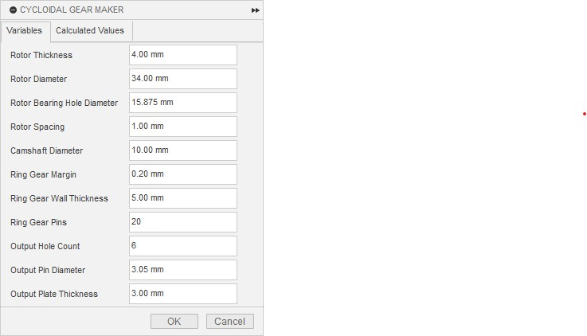
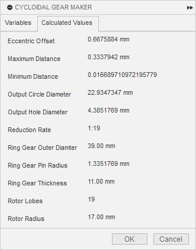

# cycloidal-gear-maker
A cycloidal gear maker add-in for Fusion360.

A cycloidal gear is a type of gear mechanism that uses a disc with lobes, called a cycloidal disc, that meshes with a ring gear with internal teeth. The cycloidal disc rotates eccentrically inside the ring gear, creating a smooth and continuous motion. The cycloidal gear has several advantages over other types of gears, such as high efficiency, low noise, high torque capacity, and compact size. The cycloidal gear can achieve a high reduction ratio in a single stage, which means it can reduce the speed and increase the torque of the input shaft with fewer components. The reduction ratio of a cycloidal gear is calculated by the formula:

r = (P - L) / L

where r is the reduction ratio, P is the number of teeth on the ring gear, and L is the number of teeth on the cycloidal disc. The cycloidal gear is widely used in various applications, such as robotics, aerospace, and industrial machinery.

Here's the wiki: https://en.wikipedia.org/wiki/Cycloidal_drive

## How to:

### Credit to mawildoer for original script (https://github.com/mawildoer/cycloidal_generator)

ROBOT,ACTUATOR,GEAR,3D,PRINT,FUSION,360,FUSION360,ADD-IN,ADDIN
